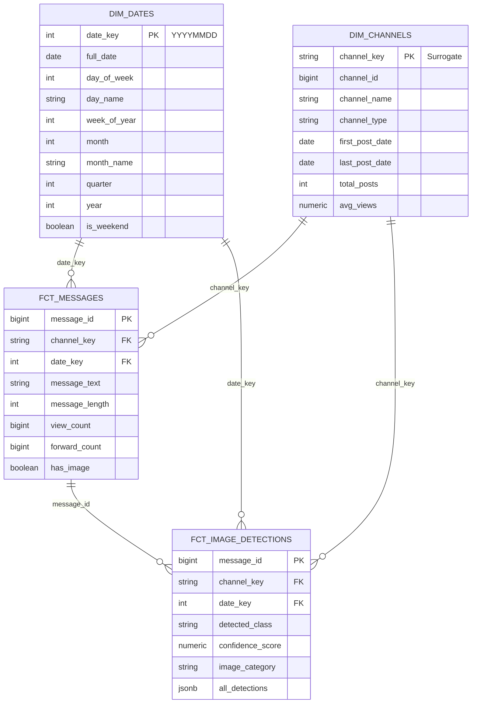
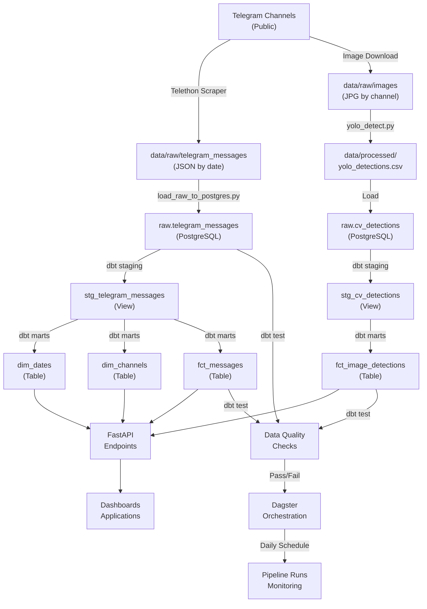

# Star Schema Diagram (Mermaid)

## Entity-Relationship Diagram



## Data Flow Diagram



## Dimensional Model Grain

```
Fact Table: fct_messages
Grain: One row per message
Primary Key: message_id
Foreign Keys: channel_key, date_key

Example:
┌────────────┬─────────────┬──────────┬──────────────────────┬────────────┬────────────┬──────────┐
│ message_id │ channel_key │ date_key │ message_text         │ view_count │ forward_ct │ has_img  │
├────────────┼─────────────┼──────────┼──────────────────────┼────────────┼────────────┼──────────┤
│ 12345      │ abc123      │ 20250118 │ "New paracetamol..." │ 1250       │ 45         │ true     │
│ 12346      │ abc123      │ 20250118 │ "Stock available"    │ 890        │ 32         │ false    │
│ 12347      │ def456      │ 20250118 │ "Discount offer"     │ 2100       │ 78         │ true     │
└────────────┴─────────────┴──────────┴──────────────────────┴────────────┴────────────┴──────────┘

Dimension: dim_channels
Grain: One row per channel
Primary Key: channel_key

Example:
┌─────────────┬────────────┬──────────────────────┬──────────────┬────────────────┬──────────────┬──────────────┬───────────┐
│ channel_key │ channel_id │ channel_name         │ channel_type │ first_post_dt  │ last_post_dt │ total_posts  │ avg_views │
├─────────────┼────────────┼──────────────────────┼──────────────┼────────────────┼──────────────┼──────────────┼───────────┤
│ abc123      │ 123456789  │ Medical Supplies     │ Medical      │ 2025-01-01     │ 2025-01-18   │ 1523         │ 850.25    │
│ def456      │ 987654321  │ Pharma Distributors  │ Pharmaceutical│ 2025-01-05    │ 2025-01-18   │ 892          │ 1200.50   │
└─────────────┴────────────┴──────────────────────┴──────────────┴────────────────┴──────────────┴──────────────┴───────────┘

Dimension: dim_dates
Grain: One row per calendar date
Primary Key: date_key

Example:
┌──────────┬────────────┬─────────────┬──────────┬──────────────┬───────┬────────────┬─────────┬──────┬────────────┐
│ date_key │ full_date  │ day_of_week │ day_name │ week_of_year │ month │ month_name │ quarter │ year │ is_weekend │
├──────────┼──────────���─┼─────────────┼──────────┼──────────────┼───────┼────────────┼─────────┼──────┼────────────┤
│ 20250118 │ 2025-01-18 │ 6           │ Saturday │ 3            │ 1     │ January    │ 1       │ 2025 │ true       │
│ 20250117 │ 2025-01-17 │ 5           │ Friday   │ 3            │ 1     │ January    │ 1       │ 2025 │ false      │
└──────────┴────────────┴─────────────┴──────────┴──────────────┴───────┴────────────┴─────────┴──────┴────────────┘

Bridge Table: fct_image_detections
Grain: One row per image detection
Primary Key: (message_id, detected_class) or auto-increment
Foreign Keys: message_id, channel_key, date_key

Example:
┌────────────┬─────────────┬──────────┬──────────────────┬────────────────┬──────────────────┐
│ message_id │ channel_key │ date_key │ detected_class   │ confidence_scr │ image_category   │
├��───────────┼─────────────┼──────────┼──────────────────┼────────────────┼──────────────────┤
│ 12345      │ abc123      │ 20250118 │ person           │ 0.95           │ promotional      │
│ 12345      │ abc123      │ 20250118 │ bottle           │ 0.87           │ promotional      │
│ 12346      │ abc123      │ 20250118 │ bottle           │ 0.92           │ product_display  │
└────────────┴─────────────┴──────────┴──────────────────┴────────────────┴──────────────────┘
```

## Query Patterns

### Pattern 1: Top Posts by Engagement
```sql
SELECT
    fm.message_id,
    dc.channel_name,
    fm.message_text,
    fm.view_count + fm.forward_count as engagement,
    dd.full_date
FROM fct_messages fm
JOIN dim_channels dc ON fm.channel_key = dc.channel_key
JOIN dim_dates dd ON fm.date_key = dd.date_key
WHERE dd.full_date >= CURRENT_DATE - INTERVAL '30 days'
ORDER BY engagement DESC
LIMIT 20;
```

### Pattern 2: Channel Performance Over Time
```sql
SELECT
    dc.channel_name,
    dd.full_date,
    COUNT(*) as daily_posts,
    AVG(fm.view_count) as avg_views,
    SUM(fm.view_count) as total_views
FROM fct_messages fm
JOIN dim_channels dc ON fm.channel_key = dc.channel_key
JOIN dim_dates dd ON fm.date_key = dd.date_key
WHERE dc.channel_name = 'Medical Supplies'
GROUP BY dc.channel_name, dd.full_date
ORDER BY dd.full_date DESC;
```

### Pattern 3: Image Content Analysis
```sql
SELECT
    fid.image_category,
    COUNT(*) as count,
    AVG(fm.view_count) as avg_views,
    AVG(fm.forward_count) as avg_forwards
FROM fct_image_detections fid
JOIN fct_messages fm ON fid.message_id = fm.message_id
GROUP BY fid.image_category
ORDER BY count DESC;
```

### Pattern 4: Product Mentions by Category
```sql
SELECT
    dc.channel_type,
    COUNT(*) as post_count,
    AVG(fm.view_count) as avg_views,
    COUNT(CASE WHEN fm.has_image THEN 1 END) as with_images
FROM fct_messages fm
JOIN dim_channels dc ON fm.channel_key = dc.channel_key
GROUP BY dc.channel_type
ORDER BY post_count DESC;
```

## Materialization Strategy

| Model | Type | Refresh | Use Case |
|-------|------|---------|----------|
| stg_telegram_messages | View | On-demand | Staging layer, no storage |
| dim_dates | Table | Daily | Time-based joins, small volume |
| dim_channels | Table | Daily | Channel aggregates, small volume |
| fct_messages | Table | Daily (incremental) | Core fact, large volume |
| fct_image_detections | Table | Daily (incremental) | Detection results, medium volume |

## Performance Considerations

**Indexes:**
```sql
CREATE INDEX idx_fct_messages_date_key ON fct_messages(date_key);
CREATE INDEX idx_fct_messages_channel_key ON fct_messages(channel_key);
CREATE INDEX idx_fct_messages_has_image ON fct_messages(has_image);
CREATE INDEX idx_fct_image_detections_image_category ON fct_image_detections(image_category);
```

**Partitioning (future):**
```sql
-- Partition fct_messages by date_key for large volumes
CREATE TABLE fct_messages_2025_01 PARTITION OF fct_messages
    FOR VALUES FROM (20250101) TO (20250201);
```

**Incremental models (future):**
```sql
-- dbt incremental materialization
{{ config(
    materialized='incremental',
    unique_key='message_id',
    on_schema_change='fail'
) }}
```
